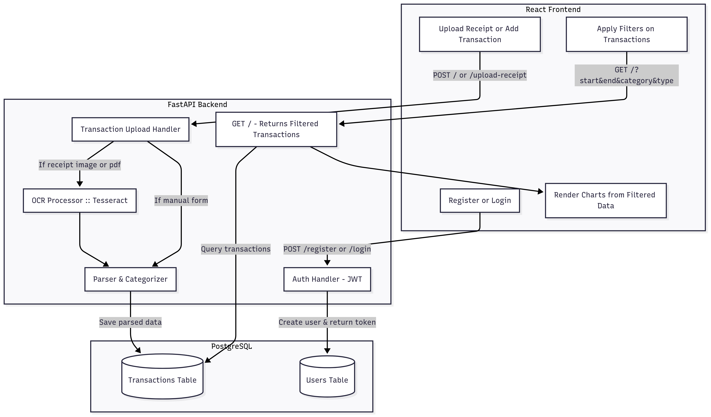

# 💰 Personal Finance Assistant

A full-stack Personal Finance Assistant web application to help users manage expenses, upload receipts, categorize spending, and gain insights into their financial habits using OCR and charts.


## 🚀 Features
- 📄 Upload receipts (image/pdf)
- 🔍 OCR-based text extraction using Tesseract
- 📊 View transactions(Expenses/Income) using piechart
- 🔐 Authentication (JWT-based)
- 🎯 Dashboard with analytics
- 🔁 Persistent state with FastAPI + Postgres

## 🛠 Tech Stack

| Category        | Tech                                   |
|-----------------|----------------------------------------|
| Frontend        | React, Tailwind CSS, React Router      |
| Backend         | FastAPI, Python, Pydantic              |
| OCR Processing  | Tesseract OCR, OpenCV                  |
| Database        | PostgreSQL       |
| Auth            | JWT          |
| Deployment      | Docker  |


## 📁 Folder Structure

```
personal-finance-assistant/
├── backend/
│   ├── main.py
│   ├── Dockerfile
│   ├── requirements.txt
│   ├── models/
│   ├── routers/
│   ├── services/
│   ├── schemas/
│   ├── utils/
│   └── databases/
├── frontend/
│   ├── src/
│   │   ├── components/
│   │   ├── pages/
│   │   ├── api/
│   │   ├── utils/
│   │   └── App.jsx
└── README.md
```

## 🔐 API Endpoints

### 🔑 Auth Routes

| Method | Endpoint  | Description              |
| ------ | --------- | ------------------------ |
| POST   | /register | Register a new user      |
| POST   | /login    | Login and get token      |

### 📄 Receipt & Transaction Routes

| Method | Endpoint       | Description              |
| ------ | -------------- | ------------------------ |
| GET   | /   | Lists all transactions |
| POST    | /   | Adds a new transaction    |
| POST   | /upload-receipt      | Uploading a receipt image  |
| POST | /upload-pdf | Uploading a receipt/transaction history (PDF)  |


## 🧠 Workflow




## 📽️ Working Demo

[Video](https://www.youtube.com/watch?v=meygr53kEm8)


## 🧪 Running the Project

### 1️⃣ Clone the Repository

```bash
git clone https://github.com/AmrutaJayanti/Personal-Finance-Assistant.git
```


### 🖥️ Option 1: Run Locally (No Docker)

#### 💻 Frontend

```bash
cd frontend
npm install
npm run dev
```

#### 🔧 Backend

```bash
cd backend
python -m venv venv
source venv/bin/activate  # For Windows: venv\Scripts\activate
pip install -r requirements.txt
# Ensure .env is properly set with DATABASE_URL, etc.

uvicorn main:app --reload
```


### 🐳 Option 2: Run Backend with Docker

#### 🔨 Build and Run Backend Container

```bash
cd backend
docker build -t finance-backend .
docker run -d -p 8000:8000 --env-file .env finance-backend
```


🔗 Frontend: [http://localhost:5173](http://localhost:5173)

🔗 Backend: [http://localhost:8000](http://localhost:8000)


For both the ways ensure `.env` file is setup properly

For `frontend`:

```
VITE_API_URL= <Your-backend-url>
```

For `backend`:

```
DATABASE_URL= <Your-database-url>
SECRET_KEY=<Your-secret-key>
ALGORITHM=HS256
ACCESS_TOKEN_EXPIRE_MINUTES=30
CORS_ORIGINS=http://localhost:5173 or <your-frontend-app-url>
```


